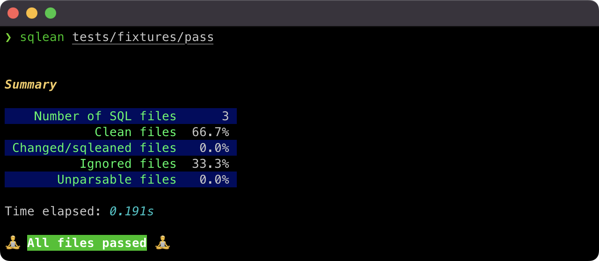
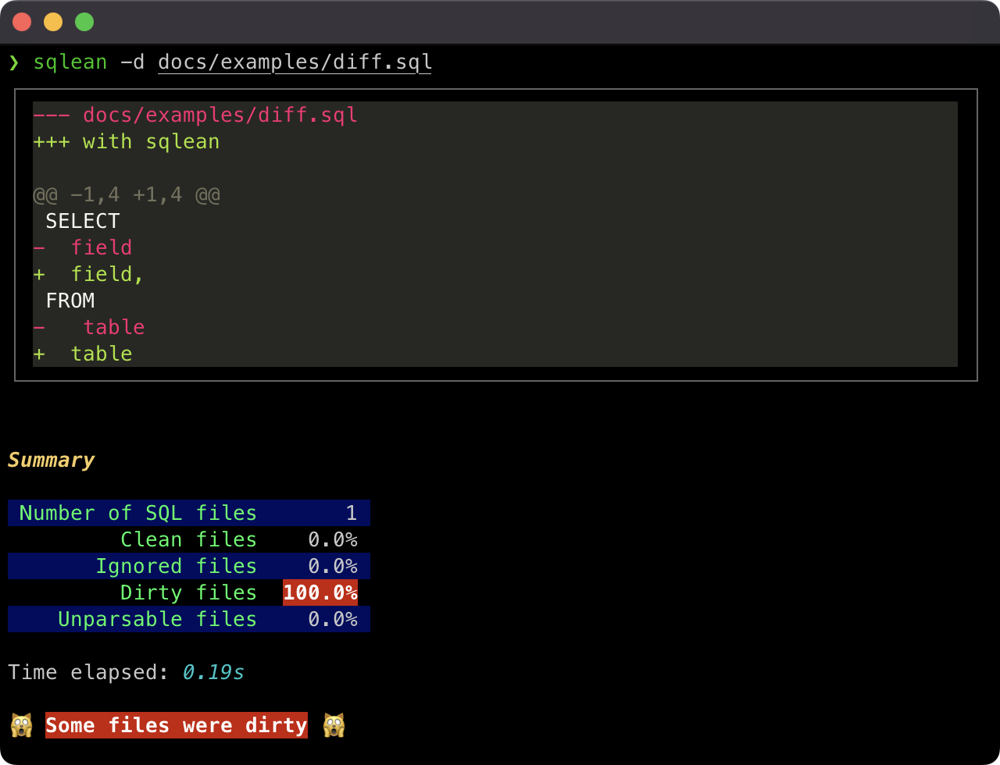
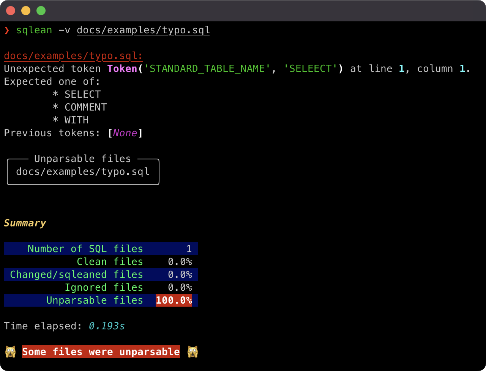

# sqlean

<p align="center">
  <a href='https://coveralls.io/github/oliverxchen/sqlean'></a>
  <a href="https://www.python.org/"></a>
  <a href="https://pypi.org/project/sqlean/"></a>
  <a href="https://github.com/psf/black"></a>
  <a href="https://github.com/oliverxchen/sqlean/blob/main/LICENSE"></a>
</p>

sqlean is a Python CLI to clean your SQL queries. It aspires to be the
[black](https://black.readthedocs.io/en/stable/) for SQL queries:
an uncompromising query formatter that imposes a strict, strongly-opinionated
formatting standard, with an easy workflow to achieve that standard.

Early releases of sqlean will support
[BigQuery](https://cloud.google.com/bigquery) dialect SQL queries with or
without [dbt](https://www.getdbt.com/) syntax. If there's sufficient interest,
other SQL dialects can be added.

**WARNING: this is very early in sqlean's life and it should not be used in
production.**

* [Usage](#usage)
  * [Installing](#installing)
  * [sqlean command](#sqlean-command)
  * [Workflow](#workflow)
  * [Configuring sqlean](#configuring-sqlean)
* [Why](#why)
  * [Current state of sqlean](#sqlean)
  * [Alternatives](#alternatives)
* [Formatting SQL](#formatting-sql)
* [Future plans](#future-plans)
* [Contributing](#contributing)
  * [Reporting issues](#reporting-issues)
  * [Writing a PR](#writing-a-pr)
* [Important dependencies](#important-dependencies)

## Usage

### Installing

Make sure you're in a virtual environment and install
sqlean with pip:

 ```bash
 pip install sqlean
 ```

### sqlean command

The sqlean CLI has one argument and several options. The one argument in the
sqlean CLI is the `TARGET` which can be a file or a directory. If the `TARGET`
is a directory, sqlean will be applied to all SQL files within the directory and
all sub-directories.

When sqlean is run without any options, SQL files will be changed in place so
that the files comply with sqlean's formatting rules. Here's an example of a
successful run (with no options):



sqlean is thoroughly tested to ensure that original queries have the same
abstract syntax tree (AST) as the formatted query. In plain English, that means
that sqlean should never break a query. But sqlean is very new so if you don't
fully trust sqlean yet, you can use the dry-run option (`-d`/`--dry-run`)
to display the diff that would happen if sqlean is run for real on the file :



Because sqlean needs to build an AST, if sqlean doesn't understand an SQL query
then it is unparsable. In this case, the example query is unparsable because
there's a problem with the query, and the verbose option (`-v`/`--verbose`)
points to the problem:



Brief documentation on sqlean commands can be accessed with:

```bash
sqlean --help
```

### Workflow

Once sqlean is production ready, it is ideally used in your continuous
integration (CI) workflow so that a pull request that adds or changes SQL
queries can only be merged if sqlean runs without errors (i.e. with the final
message "All files passed").

When you first introduce sqlean into your workflow, many of your SQL files can be
automatically fixed. In an example production query-base of over 1,600 files,
nearly 60% of queries could be automatically fixed.

The other SQL files are unparsable. sqlean will need further development to
treat these files and you can help by [reporting the issue](#reporting-issues)
so that the problem can be addressed.

In the mean time though, the unparsable files can be marked so that sqlean knows
to ignore them in CI runs. You can do this automatically by running sqlean with
the ignore option (`-i`/`--write-ignore`), or just by inserting this comment as
the first line of the file that you want ignored:

```sql
# sqlean ignore
```

If some of the issues are addressed by a future version of sqlean, you can
upgrade sqlean and automatically remove the ignore indicators with the force
(`-f`/`--force`) option.

### Configuring sqlean

CLI options are for options that can change from one run of `sqlean` to another.
Project level configuration will not change from one run to another, and must be
set in [`pyproject.toml`](https://snarky.ca/what-the-heck-is-pyproject-toml/).
One exception is the `TARGET` directory or file that can be both a project level
setting and also change from one run to another, so it can appear in both
`pyproject.toml` or as a CLI argument.

In `pyproject.toml`, sqlean options go in a `[tool.sqlean]` section. The options
are:

* `includes`: a single path or list of paths to include when sqlean is run. This
  will be over-ridden by the `TARGET` argument in the CLI when it is supplied.
  The default value is `None`, in which case `TARGET` must be used.
* `indent_size`: an integer that indicates the number of spaces in the indent.
  The default value is 2.
* `whisper`: (NOT YET IMPLEMENTED) a boolean which should be set to `true` to
  make all SQL reserved words and function names all lower case. The default
  value is `false`, which makes all SQL reserved words and function names
  all-caps.
* `max_line_length`: (NOT YET IMPLEMENTED) an integer value which adds
  additional line breaks if a line is longer than this value. The default value
  is `-1` to indicate that no maximum will be applied.
* `dialect`: (NOT YET IMPLEMENTED) a string to indicate the SQL dialect used in
  the project. The default value is `"BIGQUERY"`

## Why

In the last few years, the usage of SQL in big data processing has steadily
increased with the emergence of computational engines like [Google Cloud
BigQuery](https://cloud.google.com/bigquery), [Amazon
Redshift](https://aws.amazon.com/redshift/),
[Snowflake](https://www.snowflake.com/) and others with SQL interfaces.

Leveraging on the growth of SQL, [dbt](https://www.getdbt.com) has gained
wide-spread adoption as a tool to orchestrate the running of SQL queries. While
analytics and feature generation pipelines were previously written
primarily in programming languages like Python or Scala, they are now mostly dbt
code: a combination of SQL and [jinja](https://jinja.palletsprojects.com/)
templating.

The tooling around dbt code does not have the maturity as tooling around
older languages like Python. We see code formatting and styling as a critical
part of tooling around a language: consistently formatted code makes it easier to
collaborate within a team by making it faster and easier to read other people's
code.

[Black](https://black.readthedocs.io/) has emerged as the most popular code
formatter for Python for a couple reasons:

1. There are few options so there is little to argue about when setting it up
for the first time.
1. If two versions of a piece of code have the same AST, they will have the same
black formatted output (modulo minor differences in line spacing).

The strong consistency in formatting means that sometimes the output looks a bit
strange or at least different than what you're used to. But over time our brains
adjust and it becomes faster to read black formatted code.

sqlean aspires to play the same rule with SQL/dbt queries. By using sqlean,
you'll give up control on exactly how your queries are formatted and styled, but
you'll gain strong consistency in the formatting. No more nitpicking in code
reviews and no more getting used to other team members' query styles.

### Current state of sqlean

These are very early, experimental days in the development of sqlean so these
numbers will change. On a production code base of 1,615 queries, 58.7% could be
parsed and formatted and the other 42.3% could not be parsed. It takes 8.8
seconds for sqlean to attempt to parse and fix these queries. The time increases
as more queries can be parsed, so it is expected to take roughly 15 seconds when
most or all of the queries can be parsed.

### Alternatives

There are other SQL formatting/linting tools out there and some may be more
suitable for you.

#### [SQLFluff](https://www.sqlfluff.com/)

> SQLFluff is a dialect-flexible and configurable SQL linter. Designed with ELT
applications in mind, SQLFluff also works with Jinja templating and dbt.
SQLFluff will auto-fix most linting errors, allowing you to focus your time on
what matters.

sqlfluff is the main alternative to sqlean with wide community adoption and
active contributions (4000+ Github stars and 150 contributors). sqlfluff has a
wide array of rules that can be customized. Time to auto-format queries can vary
widely. Running sqlfluff on the production code base of 1,615 queries took too
long, so a subset of 617 queries was used for comparison:

|                         | sqlean | sqlfluff |
| :---------------------- | -----: | -------: |
| Time to auto-format (s) | 3.8    | 1325.3   |
| # files auto-formatted  | 388    | 228      |
| Version                 | 0.0.3  | 0.13.1   |

While sqlfluff's performance depends on the starting queries, on this sample
sqlean was able to run nearly 350 times faster than sqlfluff and was able to
auto-format 70% more files than sqlfluff. sqlfluff was run with the default
rules using the command: `sqlfluff fix -f --dialect bigquery`.

Language: Python

#### [ZetaSQL](https://github.com/google/zetasql)

> ZetaSQL defines a language (grammar, types, data model, and semantics) as well
as a parser and analyzer.

It is a Google project (but not official) that is used for BigQuery, Cloud
Spanner and Dataflow. An improved formatter is in progress, and a
[fork](https://github.com/Matts966/zetasql-formatter) provides a formatter with
preserved comments.

Language: C++

#### [SQLLanguageServer](https://github.com/joe-re/sql-language-server)

SQLLanguageServer provides auto-completion for editors, parsing and linting and
has a VS Code extension. It has support for MySQL, PostgreSQL and SQLite3.

Language: TypeScript

#### [dbt-sql-formatter](https://github.com/dbt-labs/dbt-sql-formatter)

From dbt Labs, unfortunately this is in an early stage and hasn't had
new commits in two years.

Language: Python

#### [sqlparse](https://github.com/andialbrecht/sqlparse)

> sqlparse is a non-validating SQL parser for Python. It provides support for
parsing, splitting and formatting SQL statements.

Language: Python

#### [SQLint](https://github.com/purcell/sqlint)

> SQLint is a simple command-line linter which reads your SQL files and reports
any syntax errors or warnings it finds.

Language: Ruby

## Formatting SQL

Whenever a formatting choice needs to be made, the guiding question should be:
if black formatted SQL queries, what choice would black make? By following this
principle, sqlean formatted code will at least look familiar to the analytics
engineers who use Python and black.

This is a non-exhaustive list of formatting changes that sqlean makes:

* SQL reserved words like SELECT, AS, FROM, JOIN, etc and function names are
  written all-caps. A future `--whisper` option will force these to be all
  lower-case.
* Select lists are one item per line, with no exceptions. Even if there are only
  two or three items in the list and writing them on a single line would make a
  query more compact, there are two main reasons to write them on separate lines:
  * If more items are added to the list later, more effort on editting is needed
    and the git diff will be harder to read.
  * Not making an exception for short lists makes select lists more
    visually/spatially consistent and therefore faster to read.
* An explicit "AS" will be added to all alias statements for select items or
  tables. From _The Zen of Python_:
  > Explicit is better than implicit.
* SQL syntax allows both double and single quotes. sqlean processes quoted
  strings with black so that double quotes are usually used (with exceptions for
  strings that contain double-quotes).
* Character spacing: a single space after commas, no space between function
  names and left parentheses, etc.
* BigQuery now allows trailing commas in select lists, which obviates
  the need for leading commas (which were convenient, but aesthetically ugly).
  sqlean will insert a trailing comma in every select list. The primary reason
  is to reduce the size of future diffs. If no trailing comma is present:

  ```sql
  SELECT
    field_1,
    field_2,
    field_3
  FROM
    table
  ```

  then when you add another item, two lines need to be changed and there will be
  three lines in the diff:

  ```diff
     field_2,
  -  field_3
  +  field_3,
  +  field_4
  FROM
  ```

  If instead there is a trailing comma:

  ```sql
  SELECT
    field_1,
    field_2,
    field_3,
  FROM
    table
  ```

  then adding an item results in only a single line in the diff:

  ```diff
     field_3,
  +  field_4,
  FROM
  ```

## Future plans

* Reduce unparsable queries
* VSCode extension
* Styling improvements, e.g. dealing with long lines
* Support for other SQL dialects.
* SQL hygiene: e.g. warnings for select items in a join query that don't have a
  table reference.

## Contributing

`sqlean` will need a community effort to be capable of parsing all valid SQL
queries.

### Reporting issues

If the query is correctly written but it is unparsable by sqlean, then sqlean's
grammar needs to be extended to accommodate the valid query. You can help by
reporting the issue and providing a minimal query that demonstrates the parse
error.

### Writing a PR

The primary PRs for non core-developers are adding to sqlean's grammar and
changing its styling. We've setup the testing to make it easier to add to the
grammar so that more and more elements of valid SQL can be parsed.

Snapshot testing that is somewhat similar to snapshot testing in
[Jest](https://jestjs.io/docs/snapshot-testing) is used to make sure that:

* when the grammar is changed, parsing changes in expected ways
* when formatting changes, the format in all preceding snapshot tests change in
  expected ways

#### Snapshot files

Snapshot files are contained in `sqlean/tests/snapshots` directory.
Each snapshot file is divided into 3 parts, with each part separated by a line
with three dashes:

```text
---
```

* The first part is minimal working example (MWE) for the SQL query. This is the
  only part that needs to be human-written.
* The second part is the MWE formatted by sqlean, for easy comparison with the
  raw query written in the first part. This part will be auto-generated.
* The third part is the AST as represented by a parse tree. This makes is easier
  to understand what the grammar is doing to parse the query, and how the
  formatting should work. This part will be auto-generated.

#### Conventions

The snapshots are located in the `sqlean/tests/snapshots` directory, under
different sub-directories. The sub-directories are grouped by grammar elements.
Within each sub-directory, the files are prefixed by a three digit integer to
preserve ordering that is natural to the grammar rather than alphabetical
ordering.

The snapshot files have extension `.snapshot`. If you set up your editor to
recognise the `.snapshot` file as an `R` file, you'll get decent syntax
highlighting of the parse tree.

#### Adding to the grammar

If you run `sqlean` on a file that contains a valid SQL/dbt query but
`sqlean` marks it as "unparsable", this indicates that there is an element of
your file that is not in `sqlean`'s grammar. You can contribute to the grammar
so that the element and the file can be parsed and formatted.

1. If a query of yours cannot be parsed by sqlean, run sqlean on the single file
   with the verbose option to identify what is causing the problem:

   ```bash
   sqlean -v <your_file_name>.sql
   ```

1. Once the unparsable element has been identified, write a minimal working
   example (MWE) of an SQL query that contains the element, and which sqlean
   cannot parse.
1. Identify the sub-directory in the `sqlean/tests/snapshots` directory where
   the element should go, or if there needs to be a new sub-directory.
1. Within the sub-directories, create a new file named according to the
   [conventions](#conventions) and put your MWE in the file.
1. Run the snapshot test for this file:

   ```bash
   make snapshot L=tests/snapshots/<sub_dir>/<new_file>
   ```

   This will fail with an error printed in the snapshot file which can guide
   you on modifying the grammar so that the file can be parsed.

   If there are a number of different new files, you can use the `M` (match)
   argument instead of the `L` (location) argument to match a string within the
   file names. For example,

   ```bash
   make snapshot M=dbt
   ```

   will run the snapshot tests on all snapshot files that contain "dbt" in the
   file name.
1. The grammar for sqlean is defined in `.lark` files in `sqlean/sqlean/grammar`.
   sqlean uses [Lark](https://lark-parser.readthedocs.io/en/latest/) to parse queries
   once the grammar is defined. You can read the Lark docs or just short cut to the
   [Lark cheat sheet](https://lark-parser.readthedocs.io/en/latest/_static/lark_cheatsheet.pdf).
1. As you modify the grammar, you can check the output of the parser by running
   the `make snapshot L/M=...` command and checking what is printed in the second or
   third section of the snapshot file. Errors will appear in the second and
   third section if there is a problem with the grammar.
1. You're done modifying the grammar once the parse tree appears in the third section
   of the snapshot file and the tree is as you want it.

#### Change the formatting

Once you're happy with the parse tree, you can move on to formatting the output.

1. If the parse tree is output in the third section, there may be a styling
   related error in the second section. The error will indicate a node that is
   missing, which you can add in `sqlean/sqlean/sql_styler.py`.
1. Similar to the grammar, as you modify the formatting, you can check the output
   of the formatter by running the `make snapshot L/M=...` command and checking what is printed
   in the second section of the snapshot file. Errors will appear in the second
   section if there is a problem with the formatter.
1. Once you're happy with the formatting, you should run the tests on all existing
   snapshot files with:

   ```bash
   make snapshot
   ```

   If your parsing or formatting changed other files, it will show up here. These
   file changes will show up in git so it will be easy to see whether the change
   was intentional or not.

## Important dependencies

A few dependencies are critical to sqlean. We are eternally grateful for these
amazing projects:

* [Lark](https://github.com/lark-parser/lark) is used to parse queries into a
  tree that can then be styled. sqlean's parsing is lightning fast because of
  lark.
* [Black](https://github.com/psf/black) is used to help style some bits in
  queries, and of course is a role model for sqlean.
* [Rich](https://github.com/Textualize/rich) makes the output from sqlean easier
  for humans to read.
* [Typer](https://github.com/tiangolo/typer) made the sqlean CLI fast to
  develop.
